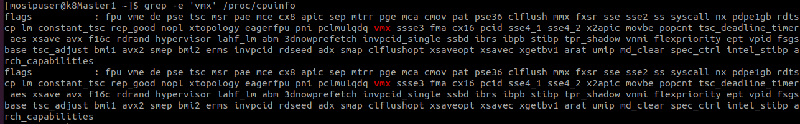
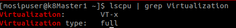
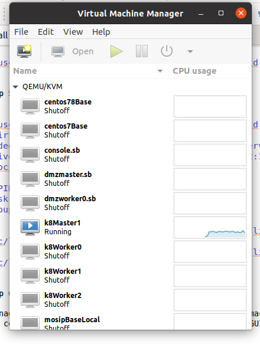

# INSTALL KVM ON CENTOS MACHINE

## Prerequisites

Make sure that your system has the hardware virtualization extensions: For Intel-based hosts, verify the CPU virtualization extension [vmx] are available using following command.

```
[mosipuser@k8Master1 ~]$ grep -e 'vmx' /proc/cpuinfo
```


Make sure that Virtualization Technology (VT) is enabled in your server’s BIOS. 

```
[mosipuser@k8Master1 ~]$ lscpu | grep Virtualization
```



### Step 1: Update the System

```
[mosipuser@k8Master1 ~]$ sudo yum update -y
...
...
Complete !!!
```

```
[mosipuser@k8Master1 ~]$ setenforce 0
```

### Step 2: Install KVM 

Install kvm and all its dependency libraries.

```
[mosipuser@k8Master1 ~]$ sudo yum install qemu qemu-kvm qemu-img libvirt libvirt-python libvirt-daemon libvirt-clients bridge-utils virt-manager -y
...
...

Complete !!!
```

```
[mosipuser@k8Master1 ~]$ sudo yum groupinstall virtualization-client virtualization-platform virtualization-tools -y
...
...

Complete !!!
```

```
[mosipuser@k8Master1 ~]$ sudo yum install virt-top libguestfs-tools libosinfo-bin  qemu-system virt-manager -y
...
...

Complete !!!
```

### Step 3: Restart libvirt

```
[mosipuser@k8Master1 ~]$ sudo systemctl restart libvirtd
```

### Step 4: Enable libvirt

```
[mosipuser@k8Master1 ~]$ sudo systemctl enable libvirtd
```

### Step 5: Check Status

```
[mosipuser@k8Master1 ~]$ sudo systemctl status libvirtd
● libvirtd.service - Virtualization daemon
   Loaded: loaded (/usr/lib/systemd/system/libvirtd.service; enabled; vendor preset: enabled)
   Active: active (running) since Wed 2020-12-30 19:12:16 IST; 6s ago
     Docs: man:libvirtd(8)
           https://libvirt.org
 Main PID: 19766 (libvirtd)
    Tasks: 19 (limit: 32768)
   CGroup: /system.slice/libvirtd.service
           ├─19766 /usr/sbin/libvirtd
           ├─19963 /usr/sbin/dnsmasq --conf-file=/var/lib/libvirt/dnsmasq/default.conf --leasefile-ro --dhcp-script=/usr/libexec/libvirt_le...
           └─19964 /usr/sbin/dnsmasq --conf-file=/var/lib/libvirt/dnsmasq/default.conf --leasefile-ro --dhcp-script=/usr/libexec/libvirt_le.
```
### Step 6: check kvm installed

```
[mosipuser@k8Master1 ~]$ virsh list --all

 Id    Name                           State
----------------------------------------------------

```
Right now there are no machines are there, therefore its empty.

### Step 7: virt-manager

virt-manager is a GUI based tool, Which helps to manage kvm machines 
we also could launch/start it from terminal as well as from GUI.

```
[mosipuser@k8Master1 ~]$ virt-manager
```
                 
 
 
 
# References

* [Techmint.com](https://www.tecmint.com/install-and-configure-kvm-in-linux/)
* [github.com](https://github.com/adrowit/ekyc/blob/master/doc/infra/kvm.md)