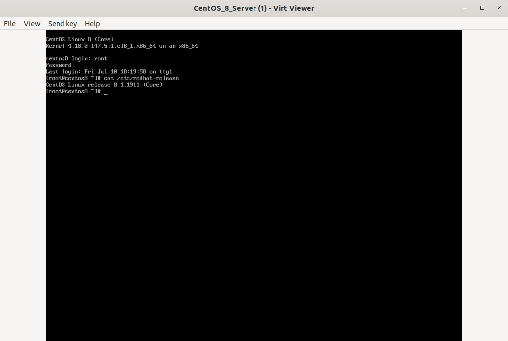
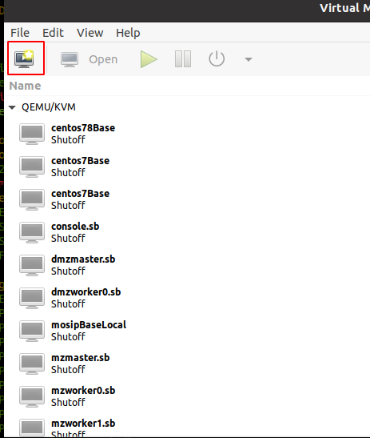
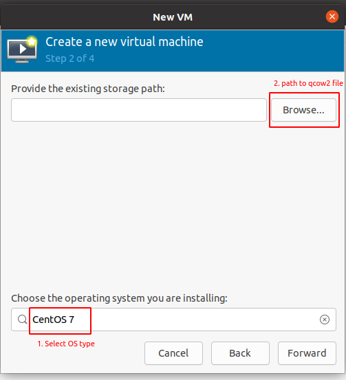
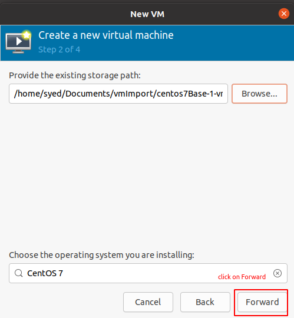
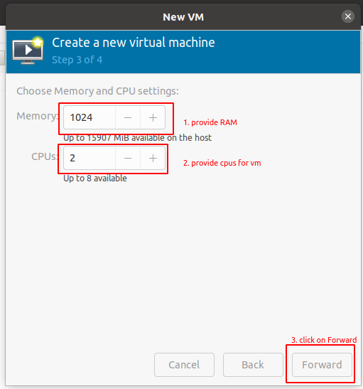
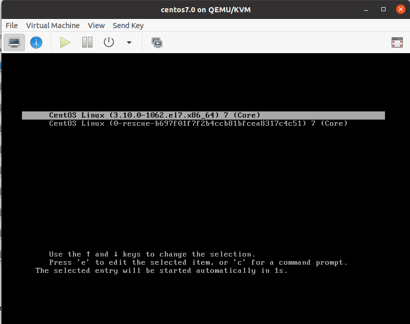

# Import or Create A KVM Virtual Machine Using Qcow2 Image

## 1. Create A KVM Virtual Machine Using Qcow2 Image

If you have qcow2 file. you can create a new vm from qcow2 file

There are two methods 

 * Using virt-install command,
 * Using Virt-manager gui application,
 
**1. virt-install**
* virt-install is a command line tool to create KVM, Xen and Linux container guests. It is part of the Virt-manager package. If you haven't installed Virt-manager yet, refer the guide attached in "Virt-manager" section below.

* To create new KVM VM using Qcow2 image, run:

```
[host@machine ~]$ virt-install --name CentOS_7_Server --memory 2048 --vcpus 1 --disk /home/sk/CentOS_7_Server.qcow2,bus=sata --import --os-variant centos7.0 --network default
```


* Replace "/home/sk/CentOS_7_Server.qcow2" with your actual path where you have saved the Qcow2 image.

* This command will create a CentOS 7 KVM instance with 2GB RAM, 1 vCPU with Qcow2 virtual disk.

* Once the VM is created, it will automatically open in Virt-viewer application. Virt-viewer is also part of the VIrt-manager package.


**2. virt-manager**

* Import Qcow2 images using Virt-manager

* Virt-manager is a graphical user interface application used for creating and managing virtual machines through libvirt. Refer the following guide to learn how to install and use Virtual-manager.

* open vert-manager

```
[host@machine ~]$ virt-manger
```


* Navigate to File -> New Virtual Machine. Virt-manager will have an "Import existing disk image" option in the first window when creating a new virtual machine. Choose it and click Forward button.


* Choose the actual path of Qcow2 image and then choose the operating system's variant you want to install. In my case, I chose CentOS 7.



* Select browse local to select the qcow2 file

 

* Select toe qcow2 file


* Select the forward



* Provide RAM, CPU for vm



* Provide vm Name


* Now wait for Installation. Press enter 



* Provide username & password


## 2. Create Use vmImportCentos7.0 script


### 1. Make A git Clone of KVM repository

* Install git on your local machine

```
[host@machine ~]$  sudo yum install git -y
```

* Goto kvm repository [link](https://github.com/123iris/kvm.git) 

```
[host@machine ~]$  cd ~
[host@machine ~]$  git clone https://github.com/123iris/kvm.git
```

### 2. Goto infra directory

```
[host@machine ~]$  cd ~/kvm/code/infra/
```

### 3. Check vmImportCentos7.0.sh file

* This script will help you to create new centos7 OS virtual machine in KVM

```
[host@machine infra]$  ls ~/kvm/code/infra/
allVmBckUpExt.sh  allVmSnapshots.sh  createVmCentos7.sh  host.list      password.txt              testHostKeyDistro.sh  vmClone.sh
allVmRstrExt.sh   allVmStart.sh      hostKeyDistro2.sh   keyDistro2.sh  reStoreAllVmSnapshots.sh  testkeyDistro2.sh     vmImportCentos7.0.sh
allVmShutdown.sh  awsVmConnChk.sh    hostKeyDistro.sh    mosip.list     rmAllVmSnapshots.sh       vmCleanerCloner.sh    vmRemove.sh
```

### 4. Run vmImportCentos7.0.sh script to create kvm machine

* Run the vmImportCentos7.0.sh scripts

```
[host@machine infra]$ bash vmImportCentos7.0.sh centos7.7 1024 1 ~/Documents/vmImport/centos7Base-1-vmSetup.qcow2
 
 USAGE: bash createCentos7Vm.sh vmName vmRAM(MiB) vCPU vmDiskPath(i.e. path to *.qcow2 ) 

 This script will create a new VM from Existing disk image (i.e using qcow2 file) 
 Do you want to continue ? (yes | no ) y
```

## 5. Now check whether vm is installed or not 

* To check vm execute the following command:

```
[host@machine infra]$ virsh list --all

 Id   Name             State
---------------------------------
 -    centos7.7        shut off     # vm Created 
 -    centos78Base     shut off
 -    centos7Base      shut off
 -    console.sb       shut off
 -    dmzmaster.sb     shut off
 -    dmzworker0.sb    shut off
 -    mosipBaseLocal   shut off
 -    mzmaster.sb      shut off
 -    mzworker0.sb     shut off
 -    mzworker1.sb     shut off
 -    nseCollectVm     shut off

```

# References

1. [ostechnix.com](https://ostechnix.com/create-a-kvm-virtual-machine-using-qcow2-image-in-linux/)
*  [ostechnix.com](https://ostechnix.com/create-a-kvm-virtual-machine-using-qcow2-image-in-linux/) 