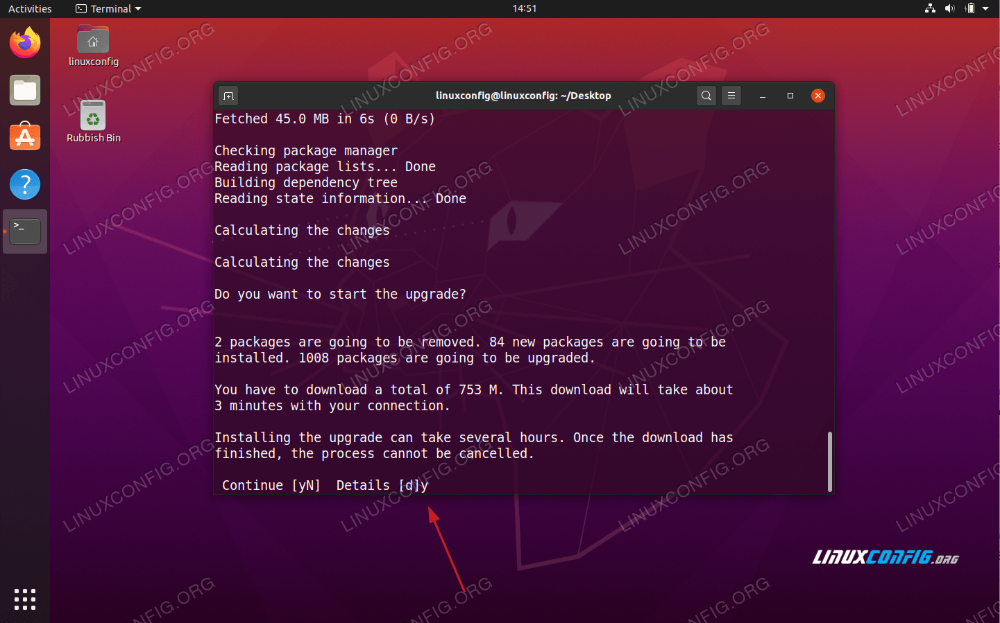

# Clone a virtual machine in KVM

* To clone from an Existing virtual machine in KVM. Follow the below steps

## 1. Make A git Clone of KVM repository

* Install git on your local machine

```
[host@machine ~]$  sudo yum install git -y
```

* Goto kvm repository [link](https://github.com/123iris/kvm.git) 

```
[host@machine ~]$  cd ~
[host@machine ~]$  git clone https://github.com/123iris/kvm.git
```

## 2. Goto infra directory

```
[host@machine ~]$  cd ~/kvm/code/infra/1-createVms/createVmUbuntu/2-CloneVms
```

## 3. Check VM clone.sh file

```
[host@machine 2-CloneVms]$  ls
vmClone.sh
```

## 4. Run vmClone.sh file to create ubuntu20.1Base machine

```
[host@machine ~]$ bash vmClone.sh ubuntu20.1Base ubuntu20Base
 Are you sure you want to clone ubuntu20.1Base from ubuntu20Base? y
 [shutdown-Machine] 
	Domain ubuntu20Base Shutdown 
	Trying to Get Status for ubuntu20Base machine :   shutoff 0 
	ubuntu20Base machine is now Shutdown  
 [clone-Machine] 
 Clone ubuntu20.1Base from ubuntu20Base
Allocating 'ubuntu20.1Base.qcow2'                                                                                      |  16 GB  00:00:03     

Clone 'ubuntu20.1Base' created successfully.
Correct the host name
[   0.0] Examining the guest ...
[   4.9] Setting a random seed
[   4.9] Setting the hostname: ubuntu20.1Base
[   6.1] Finishing off
Cleanup logs etc
[   0.0] Examining the guest ...
[   2.8] Performing "abrt-data" ...
[   2.8] Performing "backup-files" ...
[   3.1] Performing "bash-history" ...
[   3.1] Performing "crash-data" ...
[   3.1] Performing "cron-spool" ...
[   3.2] Performing "dovecot-data" ...
[   3.2] Performing "logfiles" ...
[   3.3] Performing "passwd-backups" ...
[   3.3] Performing "puppet-data-log" ...
[   3.3] Performing "sssd-db-log" ...
[   3.3] Performing "tmp-files" ...
Domain description updated successfully
Domain title updated successfully

```

* list machine

```
[host@machine ~]$ virsh list --all

 Id   Name           State
-------------------------------
 -    centos78Base   shut off
 -    centos7Base    shut off
 -    nseCollectVm   shut off
 -    ubuntu20.1Base shut off
 -    ubuntu20Base   shut off
```

## 5. Get Mac address for centos78Base machine

* Now add Mac address of centos78Base to default network file

```
[host@machine ~]$ virsh dumpxml ubuntu20.1Base | grep "mac address"
	 <mac address='52:54:00:6c:b1:48'/>
```

## 6. Add MAC address, IP address to default network 

```
[host@machine ~]$ virsh net-edit default
# Will bring up the editor
# Add following lines in the dhcp section of the XML, like so:
<network>
  <name>default</name>
  <uuid>90aae6fb-c6c4-415f-af9a-4a4b4c9f7145</uuid>
  <forward mode='nat'/>
  <bridge name='virbr0' stp='on' delay='0'/>
  <mac address='52:54:00:4a:8b:c4'/>
  <ip address='192.168.122.1' netmask='255.255.255.0'>
    <dhcp>
      <range start='192.168.122.2' end='192.168.122.254'/>
         <host mac='52:54:00:29:4b:e5' name='ubuntu20Base' ip='192.168.122.13'/>
         <host mac='52:54:00:6c:b1:48' name='ubuntu20.1Base' ip='192.168.122.14'/>   # like this
    </dhcp>
  </ip>
</network>
```

* Add the IP address to /etc/hosts file

```
[host@machine ~]$ sudo vim /etc/hosts

127.0.0.1       localhost
127.0.0.1       www.localhost
127.0.1.1       machine
192.168.122.13  ubuntu20Base
192.168.122.14  ubuntu20.1Base     # like this

# The following lines are desirable for IPv6 capable hosts
::1     ip6-localhost ip6-loopback
fe00::0 ip6-localnet
ff00::0 ip6-mcastprefix
ff02::1 ip6-allnodes
ff02::2 ip6-allrouters

```

* Restart the virtual network for assignements to take effect:

```
[host@machine ~]$ virsh net-destroy default
[host@machine ~]$ virsh net-start default
```
* Now verify whether you are able to access vms using IP address

```
[host@machine ~]$ virsh list --all

 Id   Name           	  State
-------------------------------
 -    ubuntu20.1Base   shut off
 -    ubuntu20Base     shut off
```
```
[host@machine ~]$ virsh start ubuntu20.1Base
Domain centos78Base started
```

```
[host@machine ~]$ virsh net-dhcp-leases default 

 Expiry Time           MAC address         Protocol   IP address         Hostname       Client ID or DUID
-----------------------------------------------------------------------------------------------------------
 2021-02-21 20:58:36   52:54:00:b9:8c:c3   ipv4       192.168.122.14/24   ubuntu20.1Base   -
```

* As its a clone copy of centos7Base machine. we can have passwordless access 

```
[host@machine ~]$ ssh mosipuser@ubuntu20.1Base 
The authenticity of host 'ubuntu20.1base (192.168.122.14)' can't be established.
ECDSA key fingerprint is SHA256:JGi9w9KX9o26g7XUuKLectS8FhA8UdaVZgvUyHwPV8A.
Are you sure you want to continue connecting (yes/no/[fingerprint])? yes
Warning: Permanently added 'ubuntu20.1base,192.168.122.14' (ECDSA) to the list of known hosts.
Welcome to Ubuntu 20.04.2 LTS (GNU/Linux 5.4.0-66-generic x86_64)

 * Documentation:  https://help.ubuntu.com
 * Management:     https://landscape.canonical.com
 * Support:        https://ubuntu.com/advantage

  System information as of Sunday 07 March 2021 04:12:44 PM IST

  System load:  0.29               Processes:               138
  Usage of /:   14.5% of 14.21GB   Users logged in:         0
  Memory usage: 5%                 IPv4 address for enp1s0: 192.168.122.14
  Swap usage:   0%


0 updates can be installed immediately.
0 of these updates are security updates.


mosipuser@ubuntu20:~$ 

```

## 7. Update centos from ubuntu20.04 to ubuntu20.10

This is followed from [Here](https://linuxconfig.org/how-to-upgrade-ubuntu-to-20-10) 

* Check centos version 

```
[mosipuser@ubuntu20:~]$ lsb_release -a
No LSB modules are available.
Distributor ID:	Ubuntu
Description:	Ubuntu 20.04.2 LTS
Release:	20.04
Codename:	focal
```

* Fully update and upgrade your current Ubuntu 20.04 Linux system.

```
[mosipuser@ubuntu20:~]$ sudo apt update  -y
[mosipuser@ubuntu20:~]$ sudo apt upgrade -y
[mosipuser@ubuntu20:~]$ sudo apt dist-upgrade
```
* Remove all no longer required packages:

```
[mosipuser@ubuntu20:~]$ sudo apt autoremove
```

* Configure the release upgrader. Open and edit the /etc/update-manager/release-upgrades file and ensure that the Prompt variable is set to normal.

```
[mosipuser@ubuntu20:~]$ vim /etc/update-manager/release-upgrades

# Default behavior for the release upgrader.

[DEFAULT]
# Default prompting behavior, valid options:
#
#  never  - Never check for a new release.
#  normal - Check to see if a new release is available.  If more than one new
#           release is found, the release upgrader will attempt to upgrade to
#           the release that immediately succeeds the currently-running
#           release.
#  lts    - Check to see if a new LTS release is available.  The upgrader
#           will attempt to upgrade to the first LTS release available after
#           the currently-running one.  Note that this option should not be
#           used if the currently-running release is not itself an LTS
#           release, since in that case the upgrader won't be able to
#           determine if a newer release is available.
Prompt=normal
```
Save the file

* Begin the Ubuntu 20.10 upgrade process by executing the following command:

```
[mosipuser@ubuntu20:~]$ sudo do-release-upgrade
```


* Package configuration (Select YES)

```
                                                                                                                                              
 ┌──────────────────────────────────────────────────────────┤ Configuring libc6 ├──────────────────────────────────────────────────────────┐  
 │                                                                                                                                         │  
 │ There are services installed on your system which need to be restarted when certain libraries, such as libpam, libc, and libssl, are    │  
 │ upgraded. Since these restarts may cause interruptions of service for the system, you will normally be prompted on each upgrade for     │  
 │ the list of services you wish to restart.  You can choose this option to avoid being prompted; instead, all necessary restarts will be  │  
 │ done for you automatically so you can avoid being asked questions on each library upgrade.                                              │  
 │                                                                                                                                         │  
 │ Restart services during package upgrades without asking?                                                                                │  
 │                                                                                                                                         │  
 │                                         <Yes>                                            <No>                                           │  
 │                                                                                                           
```
Please wait till all packages are configured.

* Reboot the Ubuntu20.1Base machine after updating 

```
[mosipuser@ubuntu20:~]$ sudo reboot
```

* Now check ubuntu version

```
[mosipuser@ubuntu20.1:~]$ lsb_release -a
No LSB modules are available.
Distributor ID:	Ubuntu
Description:		Ubuntu 20.10
Release:			20.10
Codename:			groovy
```
* Execute this command to clear logs & other junk data

```
[host@machine ~]$  virsh shutdown ubuntu20.1Base 
Domain ubuntu20.1Base is being shutdown
```
```
[host@machine ~]$ sudo virt-sysprep -d ubuntu20.1Base --enable abrt-data,backup-files,bash-history,crash-data,cron-spool,dovecot-data,logfiles,passwd-backups,puppet-data-log,sssd-db-log,tmp-files
 
[   0.0] Examining the guest ...
[   2.8] Performing "abrt-data" ...
[   2.8] Performing "backup-files" ...
[   3.6] Performing "bash-history" ...
[   3.6] Performing "crash-data" ...
[   3.6] Performing "cron-spool" ...
[   3.7] Performing "dovecot-data" ...
[   3.7] Performing "logfiles" ...
[   3.8] Performing "passwd-backups" ...
[   3.8] Performing "puppet-data-log" ...
[   3.8] Performing "sssd-db-log" ...
[   3.8] Performing "tmp-files" ...
```

* Provide Domain description

```
[host@machine ~]$ virsh desc ubuntu20.1Base upgraded from ubuntu20Base
Domain description updated successfully
```

* Update Domain Details

```
[host@machine ~]$ virsh desc ubuntu20.1Base --title ubuntu20Base
Domain title updated successfully
```


# Clone a List of Machine from ubuntu20.1Base machine 

* From "ubuntu20.1Base" machine we can clone/ make new machines.
* ubuntu20Base & ubuntu20.1Base is a Base machine from which other machines are created/cloned from it.

# References

1. [linuxconfig.org](https://linuxconfig.org/how-to-upgrade-ubuntu-to-20-10)
