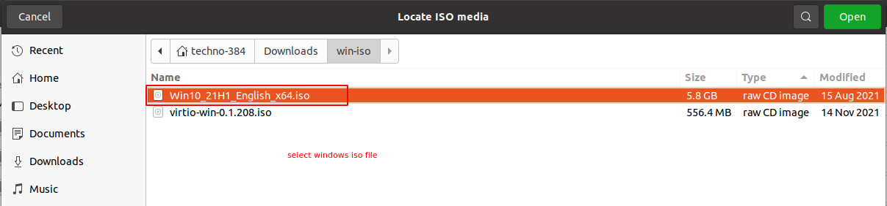
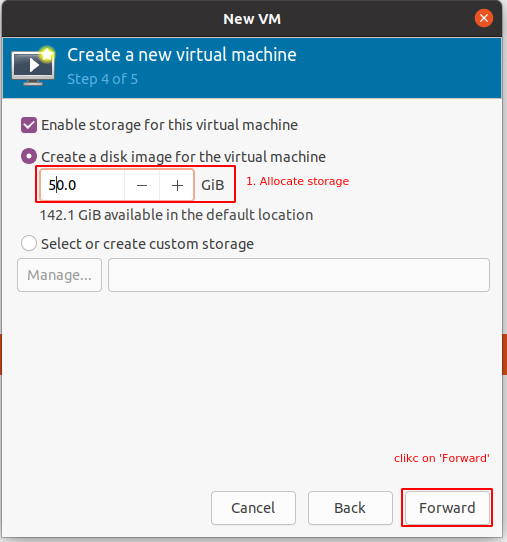
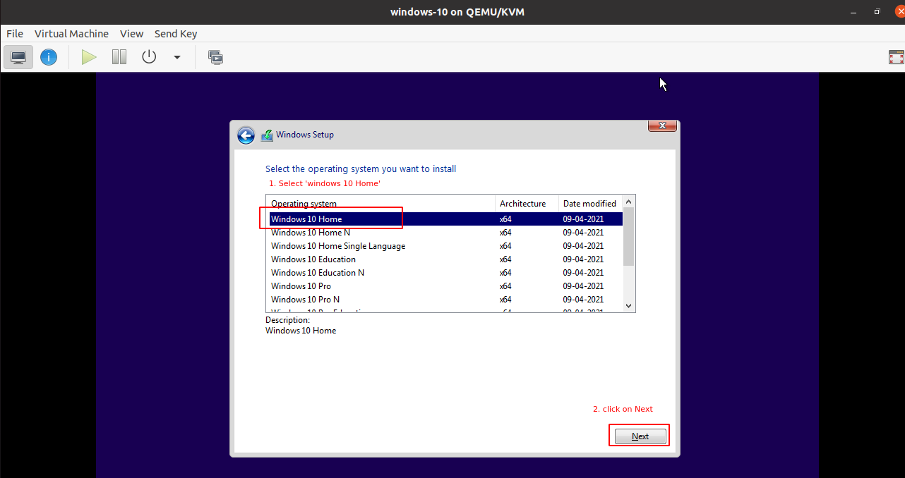
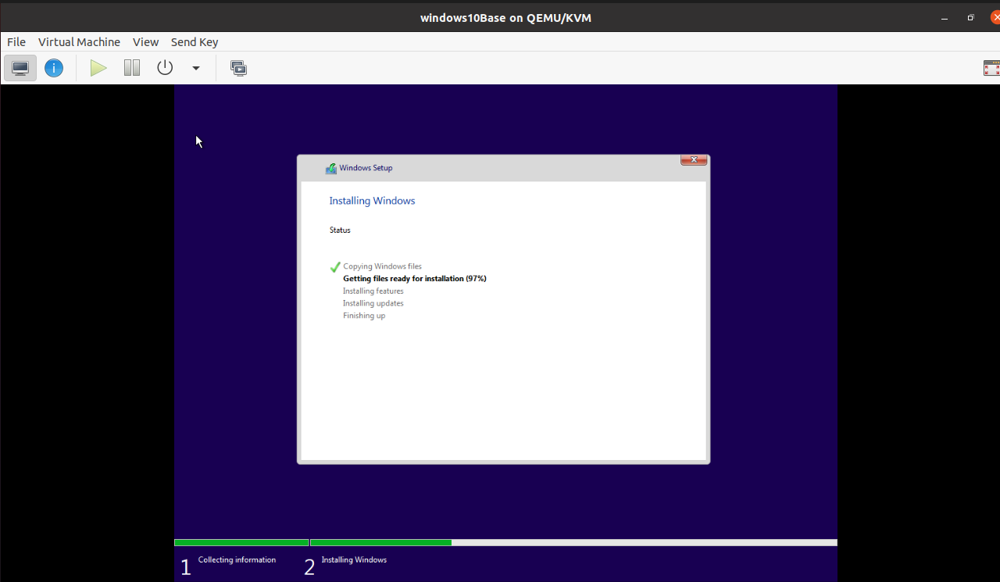
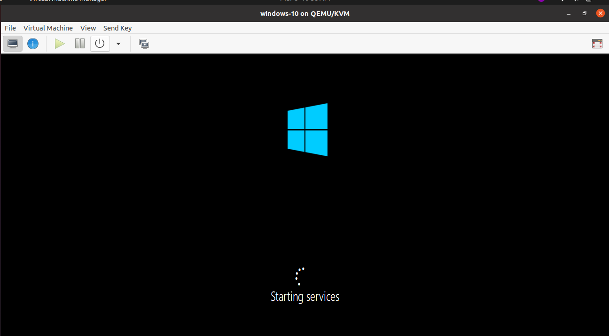
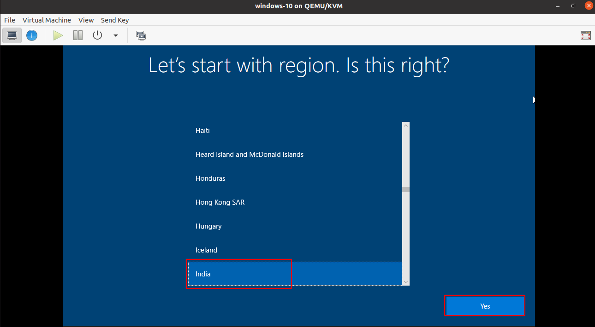
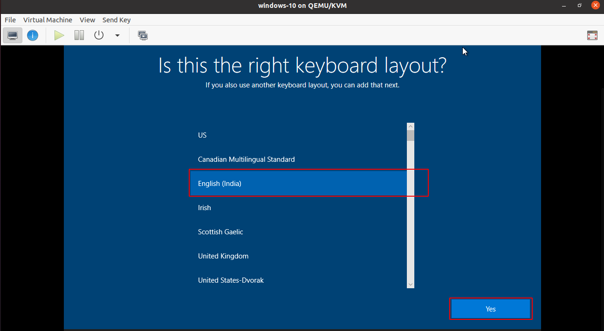
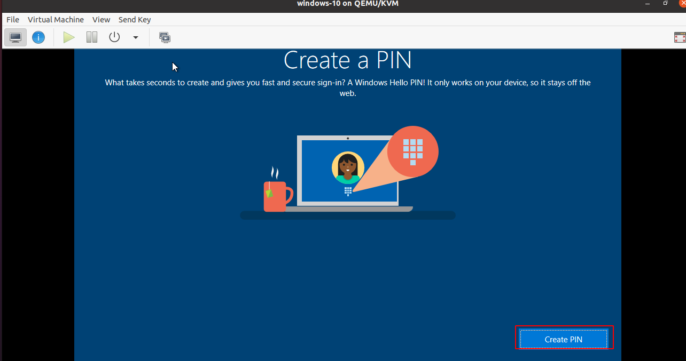
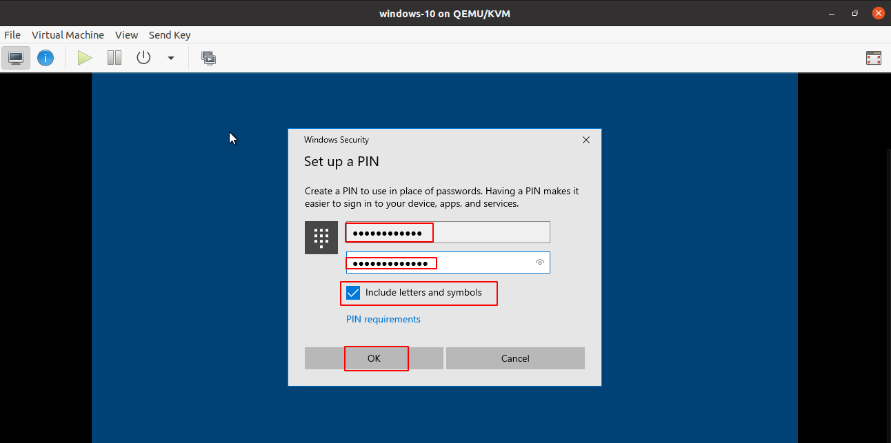
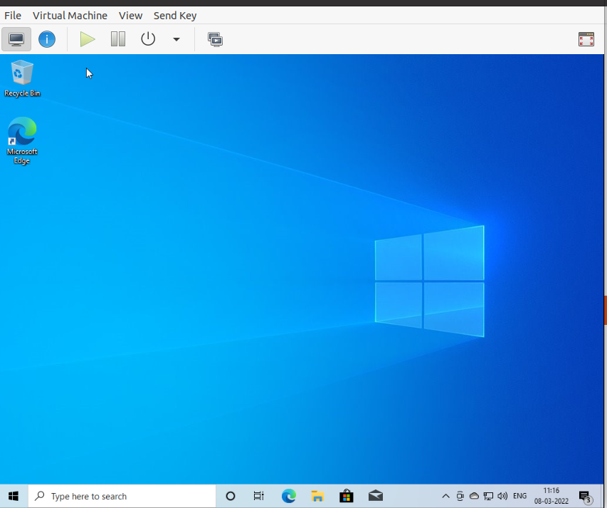

# Create a Windows 10 virtual machine using windows 10 ISO file via virt-manager UI

## Download the Windows 10 iso file from microsoft official website

## Create a windows virtual machine using virt-manager UI

1. Create new virtual machine.  
   
2. select `windows` ISO file & OS types.  
   
3. click on `Browse Local` to select ISO file from your filesystem.  
     
   
4. After selecting ISO file & OS type. click on `Forward` to continue.  
   
5. set atleast`8192` MB RAM & `4` vcpu.  
   
6. set VM storage   
   
7. Provide VM name, select KVM virtual network `NAT` And click on `Finish` to create VM.  
   
8. Select `Language` & `time` format & click on `Next` to continue. 
   
9. Click on `Install Now` to install `windows`.
   
10. Click on 'I don't have product key
    
11. Select `Windows 10 Home` & click on `Next`.
    
12. Select `I accept the terms & conditions` & Click on `Next` to continue
    
13. Click on `custom Install windows only` option. 
    
14. Select hard disk & click on `Next`.
    
15. Wait till installation completes.
      
    
16. Select `India` region & click on `Next`
    
17. Select `English (India)` keyboard layout
    
18. click on `Skip` for `Add another keyboad layout`
    
19. Login  via email
    
20. click on `Create PIN`
    
21. provide `password` & click on ok
    
22. click on `Accept` 
    
23. Setup according to your requirement.
24. Wait till setup completes.
      
      
25. Login with username & pin which you have given while creating VM  
    
26. You can even check IP of VM as shown below
    