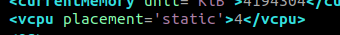
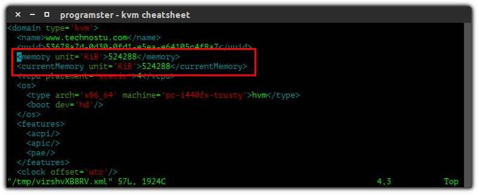

# virsh commands cheatsheet to manage KVM guest virtual machines

* Virsh is a management user interface for virsh guest domains. Virsh can be used to create, pause, restart, and shutdown domains. In addition, virsh can be used to list current domains available in your Virtualization hypervisor platform.


* Virsh interacts with Libvirt which is a library aimed at providing a long-term stable C API. It currently supports Xen, QEMU, KVM, LXC, OpenVZ, VirtualBox and VMware ESX.

* The basic structure of most virsh usage is:

```
virsh [OPTION]... <command> <domain> [ARG]...
```

## List Virtual machines

### 1. virsh display node information

* This is the first item on our virsh commands cheatsheet. 
* This displays the host node information and the machines that support the virtualization process.

```
[host@machine:~]$ sudo virsh  nodeinfo
CPU model:           x86_64
CPU(s):              8
CPU frequency:       2358 MHz
CPU socket(s):       1
Core(s) per socket:  4
Thread(s) per core:  2
NUMA cell(s):        1
Memory size:         16289340 KiB
```

### 2. List All Virtual Machines

* To list both inactive and active domains, use the command:

```
[host@machine:~]$ sudo virsh list --all
 Id    Name                           State
 ----------------------------------------------------
-     admin                          shut off
-     cloudstack                     shut off
-     hyperv                         shut off
-     ipa                            shut off
-     katello                        shut off
-     node1                          shut off
```

### 3. List only Running Virtual Machines

* To list only active domains with virsh command, use:

```
[host@machine:~]$ sudo virsh list
 Id    Name                           State
 ---------------------------------------------------- 
```

## Managing Guest State

### 1. virsh start vm

* This is an example on how to use virsh command to start a guest virtual machine. We’re going to start centosVM domain displayed above:

```
[host@machine:~]$ virsh start centosVM
Domain centosVM started

[host@machine:~]$ virsh list      
 Id    Name                           State
-----------------------------------------------------
 3     centosVMCentos                    running 
```

### 2. virsh autostart vm

* To set a vm to start automatically on system startup, do:

```
[host@machine:~]$ sudo virsh autostart centosVM
Domain centosVM marked as autostarted

[host@machine:~]$ sudo virsh dominfo centosVM  
Id:             9
Name:           centosVM
UUID:           a943ed42-ba62-4270-a41d-7f81e793d754
OS Type:        hvm
State:          running
CPU(s):         2
CPU time:       144.6s
Max memory:     2048 KiB
Used memory:    2048 KiB
Persistent:     yes
Autostart:      enable    # This is enabled
Managed save:   no
Security model: none
Security DOI:   0
```

### 3. virsh autostart disable

* To disable autostart feature for a vm:

```
 [host@machine:~]$ virsh autostart --disable centosVM
 Domain centosVM unmarked as autostarted

 [host@machine:~]$ virsh dominfo centosVM
 Id:             -
 Name:           centosVM
 UUID:           a943ed42-ba62-4270-a41d-7f81e793d754
 OS Type:        hvm
 State:          shut off
 CPU(s):         2
 Max memory:     2048 KiB
 Used memory:    2048 KiB
 Persistent:     yes
 Autostart:      disable     # This is Disabled
 Managed save:   no
 Security model: none
 Security DOI:   0
```

### 4. virsh stop vm, virsh shutdown vm

* To shutdown a running vm gracefully use:

```
virsh shutdown $VM_ID_OR_NAME


[host@machine:~]$ sudo virsh shutdown centosVM
Domain centosVM is being shutdown

[host@machine:~]$ sudo virsh list
 Id    Name                           State
----------------------------------------------------
 
```

### 5. virsh force shutdown or Destroy vm

* You can do a forceful shutdown of active domain using the command:

```
[host@machine:~]$ sudo virsh destroy centosVM
```

### 6. virsh stop/shutdown all running vms

* In case you would like to shutdown all running domains, just issue the command below:

```
[host@machine:~]$
for vm in `sudo virsh list --all | grep "running" |awk '{print $2}'`; do  
	sudo virsh shutdown $vm
done
```

### 7. virsh start all running vms

* In case you would like to shutdown all running domains, just issue the command below:

```
[host@machine:~]$ 
for vm in `sudo virsh list --all | grep "shut off" |awk '{print $2}'`; do  
	sudo virsh start $vm
done
```

### 8. virsh reboot vm

* To restart a vm named centosVM, the command used is:

```
[host@machine:~]$ sudo virsh reboot centosVM
```

### 9. Suspension

* Suspension is a way to immediately "pause" a guest so that it no longer uses the CPU, disk, or network. However, it will continue to reside in memory. 

* You may want to save/load a session instead, which would mean it no longer takes up memory, but is not instant. such that it no longer takes up memory and can be restored to its exact state (even after a reboot), it is necessary to save and restore the guest.

**NOTE:** When a domain is in a suspended state, it still consumes system RAM. Disk and network I/O will not occur while the guest is suspended.

**Warning: A suspended session will be lost if the host system is rebooted. However, a saved guest does persist.**

```
[host@machine:~]$ virsh suspend $VM_ID_OR_NAME
```

```
[host@machine:~]$ sudo virsh resume centosVM
Domain centosVM suspend
```

### 10. Resume VM

* This will cancel the suspension

```
[host@machine:~]$ virsh resume $VM_ID_OR_NAME
```
```
[host@machine:~]$ sudo virsh resume centosVM
Domain centosVM resumed
```
## Remove a VM 

* To cleanly remove a vm including its storage columes, use the commands shown below.
* The domain centosVM should be replaced with the actual domain to be removed.

```
[host@machine:~]$ sudo virsh destroy centosVM 2> /dev/null
[host@machine:~]$ sudo virsh undefine  centosVM
[host@machine:~]$ sudo virsh pool-refresh default
[host@machine:~]$ sudo virsh vol-delete --pool default centosVM.qcow2
In this example, storage volume is named /var/lib/libvirt/images/centosVM.qcow2
```

* If you want to remove vm using a shell script

```
[host@machine:~]$ cd ~/kvm/code/infra/4-vmRemove

[host@machine:~]$ bash vmRemove.sh vNode default

  USAGE: bash vmRemove.sh vmName vmPoolName 
 
 Are you sure you want to forever destroy vNode? y
```

## Create VM

### 1. virsh create a vm

* If you would like to create a new virtual machine with virsh, the relevant command to use is `virt-install. 
* This is crucial and can’t miss on virsh commands cheatsheet arsenal. 
* The example below will install a new operating system from CentOS 7 ISO Image.

```
[host@machine:~]$ sudo virt-install \
--name centos7 \
--description "centosVM VM with CentOS 7" \
--ram=1024 \
--vcpus=2 \
--os-type=Linux \
--os-variant=rhel7 \
--disk path=/var/lib/libvirt/images/centos7.qcow2,bus=virtio,size=10 \
--graphics none \
--location $HOME/iso/CentOS-7-x86_64-Everything-1611.iso \
--network bridge:virbr0  \
--console pty,target_type=serial -x 'console=ttyS0,115200n8 serial'
```
 or
 
```
[host@machine:~]$ sudo virt-install \
--name $vmName \
--ram $vmRAM \
--disk path=/var/lib/libvirt/images/"$vmName".qcow2,size="$vmDiskSize" \
--vcpus "$vCPU" \
--os-type linux \
--os-variant centos7.0 \
--network bridge=virbr0 \
--graphics none \
--console pty,target_type=serial \
--location 'http://mirror.i3d.net/pub/centos/7/os/x86_64/' \
--extra-args 'console=ttyS0,115200n8 serial'
```

### 2. clone VM

* First Shutdown vm

```
[host@machine:~]$ sudo virsh destroy vmName-1
Domain vmName destroyed
```

* Use teh below command to clone a vm in KVM

```
[host@machine:~]$ sudo virt-clone --connect qemu:///system \
--original vmName-1 \
--name vmName-2 \
--file /var/lib/libvirt/images/vmName-1.qcow2  


Allocating 'vmName-2.qcow2'       |  10 GB  00:00:06

Clone 'test_clone' created successfully.
```

```
[host@machine:~]$ sudo virsh dominfo vmName-2
Id:             -
Name:           vmName-2
UUID:           be0621fd-51b5-4d2b-a05c-ce76e59baafa
OS Type:        hvm
State:          shut off
CPU(s):         1
Max memory:     1048576 KiB
Used memory:    1048576 KiB
Persistent:     yes
Autostart:      disable
Managed save:   no
Security model: none
Security DOI:   0
```

### 3. virsh import

refer to this doc [vmImport](./infra/1-createVms/1-createVmsCentos/3-vmImport.md)

## Guest Console

### 1. Enter Guest's Console

* To connect to the guest console, use the command:

```
[host@machine:~]$ sudo virsh console centosVM
Connected to domain centosVM
Escape character is ^]

### Press enter
```
This will return a fail message if an active console session exists for the provided domain. 

### 2. Exit Guest's Console

* Use the following keyboard shortcut (not a command):

* press control + left brackets.

```
Cntrl + ]  
```

## Defining 

### 1. Defining a Guest

* Defining a guest allows one to start it from its name, rather than having to find it's XML file and running virsh create $name.xml.
* This means that guests will also show in virsh list --all when they are shutdown.

```
[host@machine:~]$ virsh define filename.xml
```

### 2. Undefine a Guest

* In order to use a name over again for a new guest, you have to undefine the old one. 
* You need to remove it's storage system as well.

```
[host@machine:~]$ virsh undefine VM_ID or vmName
```

## Guest Configuration

You can manually edit the guest's xml configuration file with:

### 1. virsh edit vm xml file
 
* To edit a vm xml file, use:

```
# To  use vim text editor

[host@machine:~]$ sudo EDITOR=vim virsh edit centosVM 

# To use nano text editor

[host@machine:~]$ sudo EDITOR=nano virsh edit centosVM
```

* You can manually edit the guest's xml configuration file with:

```
[host@machine:~]$ virsh edit $VM_ID
```
** Note: Changes will not take effect until the guest is rebooted.**

### 2. List OS Variants

* When creating a guest with virt-install you need to specify the --os-variant. 
* To get a list of acceptable values (on Ubuntu 16.04), install the libosinfo-bin package before running the command below:

```
[host@machine:~]$ osinfo-query os
```

### 3. Rename guest

* Rename VM 

```
[host@machine:~]$ virsh domrename $OLD_NAME $NEW_NAME
```

**Note: You can only do this whilst the guest is not running.**

### 4. Guest Start on Boot (Autostart)

```
[host@machine:~]$ virsh autostart $VM_ID
```

### 5. To disable Guest Autostart

```
[host@machine:~]$ virsh autostart --disable $VM_ID
```

## virsh Manage Volumes

* Here we’ll cover how to create a storage volume , attach it to a vm , detach it from a vm and how to delete a volume.

### 1. virsh create volume

* To create a 2GB volume named centosVM_vol2 on the default storage pool, use:

```
[host@machine:~]$ sudo virsh vol-create-as default  centosVM_vol2.qcow2  2G
Vol centosVM_vol2.qcow2 created

[host@machine:~]$ sudo du -sh /var/lib/libvirt/images/centosVM_vol2.qcow2
2.0G/var/lib/libvirt/images/centosVM_vol2.qcow2
```
default: Is the pool name.

centosVM_vol2: This is the name of the volume.

2G: This is the storage capacity of the volume.


### 2. virsh attach a volume to vm

* To attach created volume above to vm centosVM, run:

```
[host@machine:~]$ sudo virsh attach-disk --domain centosVM \
--source /var/lib/libvirt/images/centosVM_vol2.qcow2  \
--persistent --target vdb

Disk attached successfully
```

--persistent: Make live change persistent
--target vdb: Target of a disk device

You can confirm that the volume was added to the vm as a block device /dev/vdb

```
[host@machine:~]$ ssh root@centosVM
Last login: Fri Mar 17 19:30:54 2017 from gateway

[root@centosVM ~]# lsblk --output NAME,SIZE,TYPE
NAME                    SIZE   TYPE
sr0                     1024M  rom
vda                     10G    disk
├─vda1                  1G     part
└─vda2                  9G     part
  ├─cl_centosVM-root        8G     lvm
    └─cl_centosVM-swap      1G     lvm
    vdb                 2G     disk
```

### 3. virsh detach volume on vm

* To detach above volume centosVM_vol2 from the vm centosVM:

```
[host@machine:~]$ sudo virsh detach-disk --domain centosVM --persistent --live --target vdb
Disk detached successfully

[host@machine:~]$ ssh centosVM
Last login: Sat Mar 18 01:52:33 2017 from gateway
[root@centosVM ~]# 
[root@centosVM ~]# lsblk --output NAME,SIZE,TYPE
NAME                    SIZE   TYPE
sr0                     1024M  rom
vda                     10G    disk
├─vda1                  1G     part
└─vda2                  9G     part
  ├─cl_centosVM-root        8G     lvm
    └─cl_centosVM-swap      1G     lvm
```
You can indeed confirm from this output that the device /dev/vdb has been detached


### 4. To Increase vm volume (i.e qcow2 image)

* Please note that you can directly grow disk image for the vm using qemu-img command, this will look something like this:

* List vm Image path

```
[host@machine:~]$ virsh vol-list  --pool default
 Name                   Path
----------------------------------------------------------------------
cloudstack.qcow2     /var/lib/libvirt/images/cloudstack.qcow2
ipa.qcow2            /var/lib/libvirt/images/ipa.qcow2       
katello.qcow2        /var/lib/libvirt/images/katello.qcow2   
node1.qcow2          /var/lib/libvirt/images/node1.qcow2     
node2.qcow2          /var/lib/libvirt/images/node2.qcow2     
node3.qcow2          /var/lib/libvirt/images/node3.qcow2     
centosVM.qcow2           /var/lib/libvirt/images/centosVM.qcow2 
```

* Resize vm volume image

```
[host@machine:~]$ sudo qemu-img resize /var/lib/libvirt/images/centosVM.qcow2 +1G
```

### 5. virsh delete volume

* To delete volume with virsh command, use:

```
[host@machine:~]$ sudo virsh vol-delete centosVM.qcow2  --pool default
Vol centosVM_vol2.qcow2 deleted

[host@machine:~]$ sudo virsh pool-refresh  default
Pool default refreshed

[host@machine:~]$ sudo virsh vol-list default
 Name                 Path                                    
 ------------------------------------------------------------------------------
admin.qcow2          /var/lib/libvirt/images/admin.qcow2     
cloudstack.qcow2     /var/lib/libvirt/images/cloudstack.qcow2
ipa.qcow2            /var/lib/libvirt/images/ipa.qcow2       
katello.qcow2        /var/lib/libvirt/images/katello.qcow2   
node1.qcow2          /var/lib/libvirt/images/node1.qcow2     
node2.qcow2          /var/lib/libvirt/images/node2.qcow2     
node3.qcow2          /var/lib/libvirt/images/node3.qcow2            
```

### 6. List volumes

* List all volumes for default pool 

```
[host@machine:~]$ sudo virsh vol-list poolName
```
```
[host@machine:~]$ sudo virsh vol-list default
 Name                 Path                                    
 ------------------------------------------------------------------------------
admin.qcow2          /var/lib/libvirt/images/admin.qcow2     
cloudstack.qcow2     /var/lib/libvirt/images/cloudstack.qcow2
ipa.qcow2            /var/lib/libvirt/images/ipa.qcow2       
katello.qcow2        /var/lib/libvirt/images/katello.qcow2   
node1.qcow2          /var/lib/libvirt/images/node1.qcow2     
node2.qcow2          /var/lib/libvirt/images/node2.qcow2     
node3.qcow2          /var/lib/libvirt/images/node3.qcow2 
```

# BackUP VM

## 1. virsh save virtual machine

### 1. Save Guest

* Saves the RAM (not including disk) of a running guest to a "state file" at the specified file name/path, so that it can be restored later. 
* Once saved, the domain will no longer be running on the system, thus the memory allocated for the domain will be free for other domains to use. virsh restore (in "Load Guest" below) restores from this state file.
* To save the current state of a vm to a file using the virsh command :

```
[host@machine:~]$ sudo virsh save centosVM /home/kvmUser/centosVM.saved
Domain centosVM saved to centosVM.save

[host@machine:~]$ ls -l centosVM.save 
-rw------- 1 root root 328645215 Mar 18 01:35 centosVM.saved
```

### 2. Restore Guest

* To restore saved vm from the file:

```
[host@machine:~]$ virsh restore /home/kvmUser/centosVM.save 
Domain restored from centosVM.save

[host@machine:~]$ sudo virsh list
 Id    Name                           State
 ----------------------------------------------------
  7    centosVM                           running
```

## 2. virsh Manage Snapshots

### 1. Create snapshots

#### 1. Create snapshots using snapshot-create-as

* A snapshot – of a virtual machine – is a file-based representation of the state of the virtual machine at a given time. 
* It includes disk data and configuration data of the VM. 
* With a snapshot you can restore a machine to a previous state.

```
[host@machine:~]$ sudo virsh snapshot-create-as --domain vmName \
--name "test_vm_snapshot1" \
--description "test vm snapshot 1-working"

Domain snapshot test_vm_snapshot1 created
```

#### 2. Create snapshots using snapshot-create

* The main problem with **Save Guest** is it will just save RAM not the Disk data. So we use snapshots 
* A snapshot – of a virtual machine – is a file-based representation of the state of the virtual machine at a given time. 
* It includes disk data and configuration data of the VM. 
* With a snapshot you can restore a machine to a previous state.

```
[host@machine:~]$ sudo virsh snapshot-create --domain vmName \
Domain snapshot test_vm_snapshot1 created
```
 <center> or </center>
 
```
[host@machine:~]$ sudo virsh snapshot-create vmName \
Domain snapshot test_vm_snapshot1 created
```

#### 3. GET or SET snapshots 

```
[host@machine:~]$ sudo virsh snapshot-current vmName 
```


### 2. List Snapshots

* List snapshots of a VM

```
[host@machine:~]$ sudo virsh snapshot-list vmName
```
```
[host@machine:~]$ sudo virsh snapshot-list master1

 Name         Creation Time               State
---------------------------------------------------
 1616829574   2021-03-27 12:49:34 +0530   shutoff
```

### 3. Display Snapshot information

```
sudo virsh snapshot-info vmName Snapshot-Name
```
```
[host@machine:~]$ sudo virsh snapshot-info  master1 1616829574
Name:           1616829574
Domain:         master1
Current:        yes
State:          shutoff
Location:       internal
Parent:         -
Children:       0
Descendants:    0
Metadata:       yes
```

### 4. Restore from Snapshots / Virsh revert vm snapshot 

```
[host@machine:~]$ sudo virsh snapshot-list vmName
 Name                 Creation Time             State
 ------------------------------------------------------------
  1489689679           2017-03-16 21:41:19 +0300 shutoff
  vm-1                 2017-03-16 22:11:48 +0300 shutoff
  vm-2                 2017-03-18 02:15:58 +0300 running
  vm-3                 2017-03-18 02:23:29 +0300 running
```
```
[host@machine:~]$ sudo virsh snapshot-revert --domain vmName  --snapshotname vm-1  --running
```

### 5. Delete Snapshot 

```
[host@machine:~]$ sudo  virsh snapshot-delete vmName snapshotName
```

```
[host@machine:~]$ sudo  virsh snapshot-delete --domain vmName --snapshotname  vm-2
Domain snapshot vm-2 Deleted
```
```
[host@machine:~]$ sudo virsh snapshot-list vmName
 Name                 Creation Time             State
 ------------------------------------------------------------
  1489689679           2017-03-16 21:41:19 +0300 shutoff
  vm-1                 2017-03-16 22:11:48 +0300 shutoff
  vm-3                 2017-03-18 02:23:29 +0300 running
```

## 3. External BackUP and Restore VM 

### External BackUP VM

* The main problem with **Snapshots** is it is manager by KVM and anything goes wrong with kvm & its operating system we won't be able to restore back the vm's.
* You can take a External Backup a VM. So that we can share this VM and its data.

```
[host@machine:~]$ virsh vol-list poolName
```

* List volume for VM

```
[host@machine:~]$ virsh vol-list default

 Name                 Path
------------------------------------------------------------------
 vEngine.qcow2        /var/lib/libvirt/images/vEngine.qcow2
 vNode.qcow2          /var/lib/libvirt/images/vNode.qcow2
```

* Copy the .qcow2 file to your location

```
[host@machine:~]$ mkdir -p ~/extBckUp 
[host@machine:~]$ sudo cp /var/lib/libvirt/images/vNode.qcow2 ~/extBckUp/
[host@machine:~]$ ls ~/extBckUp/
vNode.qcow2
[host@machine:~]$ virsh dumpxml vNode > ~/extBckUp/vNode.xml
[host@machine:~]$ ls ~/extBckUp/
vNode.qcow2  vNode.xml
```

* Backup VM externally using a shell script all will be save in ls ~/allVmBckUpExt/
 
```
[host@machine:~]$ bash allVmBckUpExt.sh ~/Downloads/hosts.ini chkpt-1 default

 USAGE: bash allVmBckUpExt.sh mosipVm.list 1-keyDistro 

 This script will make BackUp of all vm's present in input file under  ~/allvmBckExt directory
 Do you want to continue ? (yes | no ) y
  
BackUp has been taken successfully all vm's!!!
```

### Restore VM From External BackUP

* Shutdown all machines 

```
[host@machine:~]$
for vm in `sudo virsh list --all | grep "running" |awk '{print $2}'`; do  
	sudo virsh shutdown $vm
done
```

* Check the backup files.

```
[host@machine:~]$ ls ~/extBckUp/
vNode.qcow2  vNode.xml
```

* Check the vms

```
[host@machine:~]$ virsh list --all
 Id   Name           State
-------------------------------
 -    centos78Base   shut off
 -    centos7Base    shut off
 -    centos8Base    shut off
 -    nseCollectVm   shut off
 -    vEngine        shut off
```

* check the path of .qcow2 files

```
[host@machine:~]$ virsh vol-list default 
 Name                 Path
------------------------------------------------------------------
 vEngine.qcow2        /var/lib/libvirt/images/vEngine.qcow2
```

* Define Guest VM using .xml file

```
[host@machine:~]$ virsh define ~/extBckUp/vNode.xml 
Domain vNode defined from /home/syed/extBckUp/vNode.xml

[host@machine:~]$ virsh list --all
 Id   Name           State
-------------------------------
 -    centos78Base   shut off
 -    centos7Base    shut off
 -    centos8Base    shut off
 -    nseCollectVm   shut off
 -    vEngine        shut off
 -    vNode          shut off
```

* Now attach volume to the create guest/VM

```
[host@machine:~]$ virsh vol-list --pool default 
 Name                 Path
------------------------------------------------------------------
 centos78Base.qcow2   /var/lib/libvirt/images/centos78Base.qcow2
 centos7Base.qcow2    /var/lib/libvirt/images/centos7Base.qcow2
 centos8Base.qcow2    /var/lib/libvirt/images/centos8Base.qcow2
 nseCollectVm.qcow2   /var/lib/libvirt/images/nseCollectVm.qcow2
 vEngine.qcow2        /var/lib/libvirt/images/vEngine.qcow2
```
* Copy .qcow2 file to your default volume path 

```
[host@machine:~]$ sudo cp ~/extBckUp/vNode.qcow2 /var/lib/libvirt/images/vNode.qcow2
```
* check the files

```
[host@machine:~]$ sudo ls /var/lib/libvirt/images
centos78Base.qcow2  centos7Base.qcow2  centos8Base.qcow2  nseCollectVm.qcow2  vEngine.qcow2  vNode.qcow2
```
* Now check the vol-list 

```
[host@machine:~]$ virsh vol-list --pool default 
 Name                 Path
------------------------------------------------------------------
 centos78Base.qcow2   /var/lib/libvirt/images/centos78Base.qcow2
 centos7Base.qcow2    /var/lib/libvirt/images/centos7Base.qcow2
 centos8Base.qcow2    /var/lib/libvirt/images/centos8Base.qcow2
 nseCollectVm.qcow2   /var/lib/libvirt/images/nseCollectVm.qcow2
 vEngine.qcow2        /var/lib/libvirt/images/vEngine.qcow2
```

* You have noticed that machine vol path has not added. So restart libvirtd service

```
[host@machine:~]$ sudo systemctl restart libvirtd
```
* Now the vNode path has been added

```
[host@machine:~]$ virsh vol-list --pool default 
 Name                 Path
------------------------------------------------------------------
 centos78Base.qcow2   /var/lib/libvirt/images/centos78Base.qcow2
 centos7Base.qcow2    /var/lib/libvirt/images/centos7Base.qcow2
 centos8Base.qcow2    /var/lib/libvirt/images/centos8Base.qcow2
 nseCollectVm.qcow2   /var/lib/libvirt/images/nseCollectVm.qcow2
 vEngine.qcow2        /var/lib/libvirt/images/vEngine.qcow2
 vNode.qcow2          /var/lib/libvirt/images/vNode.qcow2
```

* Now Restart is complete. Verify with starting the machine

```
[host@machine:~]$ virsh start vNode 
Domain vNode started
```

* Restore Multiple machines using script 

```
[host@machine:~]$ cd ~/kvm/code/infra/2-BackUpVMs

[host@machine:~]$ ls
allVmBckUpExt.sh  allVmRstrExt.sh  allVmSnapshots.sh  reStoreAllVmSnapshots.sh  rmAllVmSnapshots.sh

[host@machine:~]$ bash allVmRstrExt.sh ~/Downloads/hosts.ini chkpt-1 default

 USAGE: bash allVmRstrExt.sh mosipVm.list chkptName kvmPoolName

 This script will restore vm's present in input file from Backup ( i.e under ~/allvmBckExt )  
 Do you want to continue ? ( yes | no )  y

Successfully Restored All vm's from BackUp !!!
```


# CPU Management

* First check total CPU

```
[host@machine:~]$ virsh nodeinfo
CPU model:           x86_64 
CPU(s):              8                 # 8 cpus 
CPU frequency:       801 MHz
CPU socket(s):       1
Core(s) per socket:  4
Thread(s) per core:  2
NUMA cell(s):        1
Memory size:         16289304 KiB
```

* Execute the below command to set vcpus

```
[host@machine:~]$ sudo virsh setvcpus --domain test --maximum 2 --config
[host@machine:~]$ sudo virsh setvcpus --domain test --count 2 --config

[host@machine:~]$ sudo virsh reboot test
 Domain test is being rebooted
```
* Confirm that the number of vcpu has changed, the previous was 1, the current value is 2:

```
[host@machine:~]$ virsh dominfo test
Id:             -
Name:           test
UUID:           a943ed42-ba62-4270-a41d-7f81e793d754
OS Type:        hvm
State:          shut off
CPU(s):         2
Max memory:     1048576 KiB
Used memory:    1048576 KiB
Persistent:     yes
Autostart:      disable
Managed save:   no
Security model: none
Security DOI:   0
```

* Manager cpus for vm using virsh edit command.

```
[host@machine:~]$ virsh edit $VM_ID or vmName
```
Change the CPU fields .



## 1. Discover CPU Scheduling Parameters

```
virsh schedinfo $VM_ID 
```
```
[host@machine:~]$ virsh schedinfo vEngine
Scheduler      : posix
cpu_shares     : 0
vcpu_period    : 0
vcpu_quota     : 0
emulator_period: 0
emulator_quota : 0
global_period  : 0
global_quota   : 0
iothread_period: 0
iothread_quota : 0
```

## 2. Permanently Set CPU Shares For Live Running Instance

```
[host@machine:~]$ 
virsh schedinfo $VM_ID \
  --set cpu_shares=[0-262144] \
  --live \
  --current \
  --config
```

## 3. Get the CPU Pinning Settings for a Guest

```
[host@machine:~]$ virsh vcpupin vEngine 
 VCPU   CPU Affinity
----------------------
 0      0-7
 1      0-7
 2      0-7
 3      0-7
```

## 4. Pin A CPU

* If I wanted to set the cores that a guest can use, I could do the following:

```
[host@machine:~]$ virsh vcpupin vmName 0 2
```

* That will set the first vCPU (the one with ID 0) to only run on core ID 2. Thus the output of virsh vcpupin vmName machine changes to:

```
[host@machine:~]$ virsh vcpupin vmName 
VCPU: CPU Affinity
----------------------------------
   0: 2
   1: 0-3
```

**Note: Pinning could be a great way to limit the effect a certain guest has on others, or to give a guest a dedicated core etc.**

# Manager VM RAM

* First check total RAM

```
[host@machine:~]$ virsh nodeinfo
CPU model:           x86_64 
CPU(s):              8                 # 8 cpus 
CPU frequency:       801 MHz
CPU socket(s):       1
Core(s) per socket:  4
Thread(s) per core:  2
NUMA cell(s):        1
Memory size:         16289304 KiB       # Total RAM in KiB
```

* To adjust the total ram used by the guest operating system, the following commands are used:

```
[host@machine:~]$ sudo virsh setmaxmem test 6G --config
[host@machine:~]$ sudo virsh setmem test 6G --config
[host@machine:~]$ sudo virsh reboot test
Domain test is being rebooted
```
* Check domain info to confirm the current RAM allocated to the VM.

```
[host@machine:~]$ virsh dominfo test                     
Id:             9
Name:           test
UUID:           a943ed42-ba62-4270-a41d-7f81e793d754
OS Type:        hvm
State:          running
CPU(s):         2
CPU time:       70.7s
Max memory:     6291456 KiB
Used memory:    6291456 KiB
Persistent:     yes
Autostart:      disable
Managed save:   no
Security model: none
Security DOI:   0
```

* Manager cpus for vm using virsh edit command.

```
[host@machine:~]$ virsh edit $VM_ID or vmName
```
Change the memory and currentMemory fields to be the size you want in KiB.



#TODO:

## Mount Virtual Disk

## Networking

# References

1. [computingforgeeks.com](https://computingforgeeks.com/virsh-commands-cheatsheet/)
1. [blog.programster.org](https://blog.programster.org/kvm-cheatsheet)